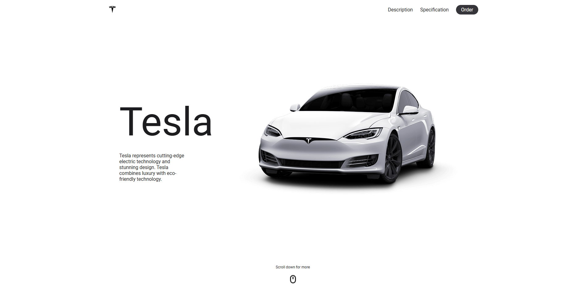
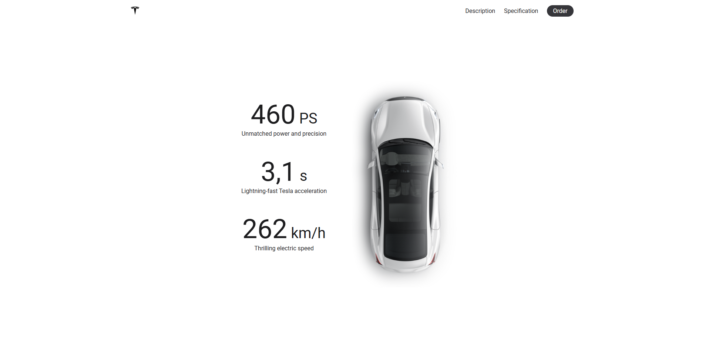
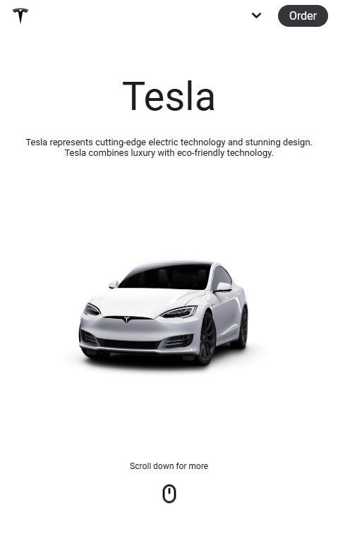
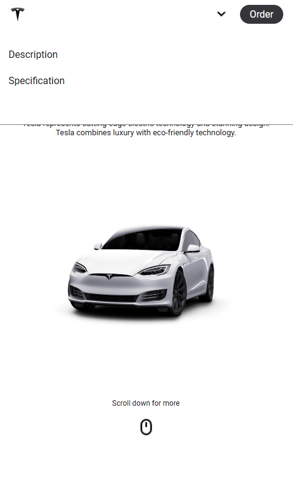
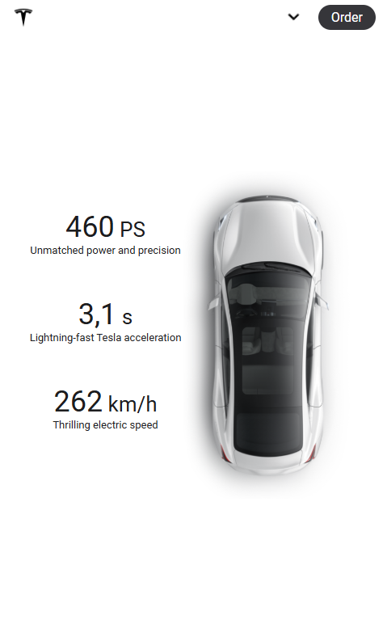

# Tesla Website Concept (responsive)

This is a simple concept website for Tesla that I created using HTML, CSS, and JavaScript. It is a responsive design that adapts to both mobile and desktop screens, showcasing my skills in front-end development and UI/UX design.

## Preview

### Desktop
       

### Mobile

            

## Demo

### Desktop
https://github.com/user-attachments/assets/7a762eec-fb81-43b5-9cff-fad4817638b3

### Mobile
https://github.com/user-attachments/assets/82fea785-2bb5-4d95-a703-a84089694524

## Status

The website is complete as a basic concept but can be further improved and extended in the future.

## Features

- Responsive design for mobile and desktop views
- Interactive elements implemented with JavaScript
- Clean and modern UI inspired by Tesla's brand

## Technologies

- HTML
- CSS
- JavaScript

## Installation

1. Clone the repository:

   ```bash
   git clone https://github.com/venu21-dev/Tesla_Website.git
